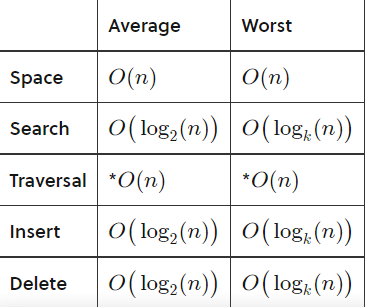

#### Vellore Institute of Technology - Vellore

## Java Programming CSE1007

- `Name` : Raja Aravindha A
- `Regno` : 20BCE2297

# Introduction to Merkle Tree

  Merkle tree also known as hash tree is a data structure used for data verification and synchronization. 
  Merkle tree is a tree data structure with leaf nodes and non leaf nodes. It also known as <b>Hash tree</b>.
  The reason behind it is it only stores the hashes in its nodes instead of data. In its leaf nodes, it will store the hash of the data. Non leaf nodes contain the hash of its children. 
  
  <li>Hash trees allow efficient and secure verification of the contents of large data structures. Hash trees are a generalization of hash lists and hash chains.
   <li>If we want to know where data change has occurred then we can check if data is consistent with root hash and we will not have to traverse the whole structure but only a small part of the structure.
<li>The root hash is used as the fingerprint for the entire data
  - Git which is a popular Version Constrol system works with distributed peer-to-peer systems and utilizes the concept of merkle Trees to achieve this.
    

  Merkle trees are particularly effective in distributed systems where two separate systems can compare the data on each node via a Merkle tree and quickly determine which data sets (subtrees) are lacking on one or the other system.  
    Then only the subset of missing data needs to be sent. Cassandra, based on Amazon's Dynamo, for example, uses Merkle trees as an anti-entropy measure to detect inconsistencies between replicas.
    
# Architecture of Merkle Tree
   Merkle trees are typically implemented as binary trees, as shown in the following image. However, a Merkle tree can be created as an nn-nary tree, with nn children per node.

In this image, we see an input of data broken up into blocks labeled L1 though L4. Each of these blocks are hashed using some hash function. Then each pair of nodes are recursively hashed until we reach the root node, which is a hash of all nodes below it.

  
 # Algorithm 
  **Time Complexity** 
  Merkle trees have very little overhead when compared with hash lists. Binary Merkle trees, like the one pictured above, operate similarly to binary search trees in that their depth is bounded by their branching factor, 2. Included below is worst-case analysis for a Merkle tree with a branching factor of kk.
  
  
  
  
  
 # Illustration of Algorithm 
  
 # References
